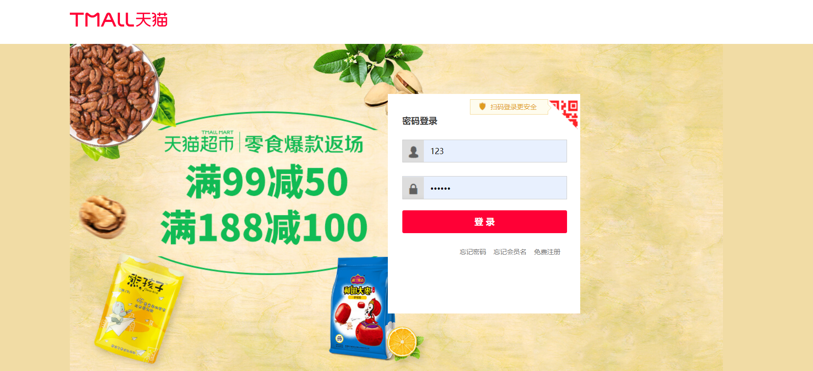
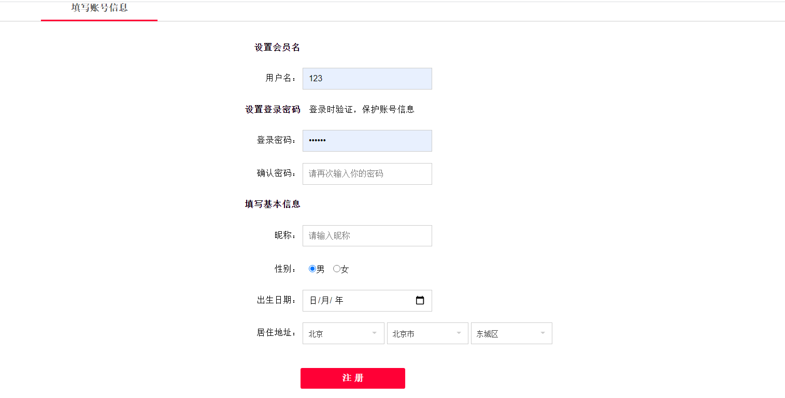
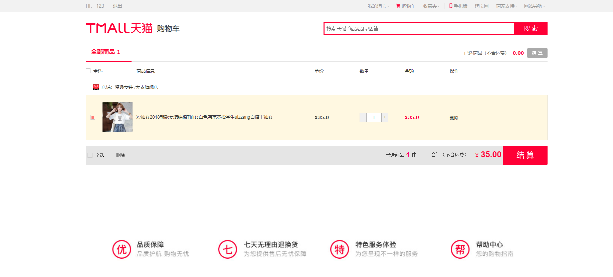
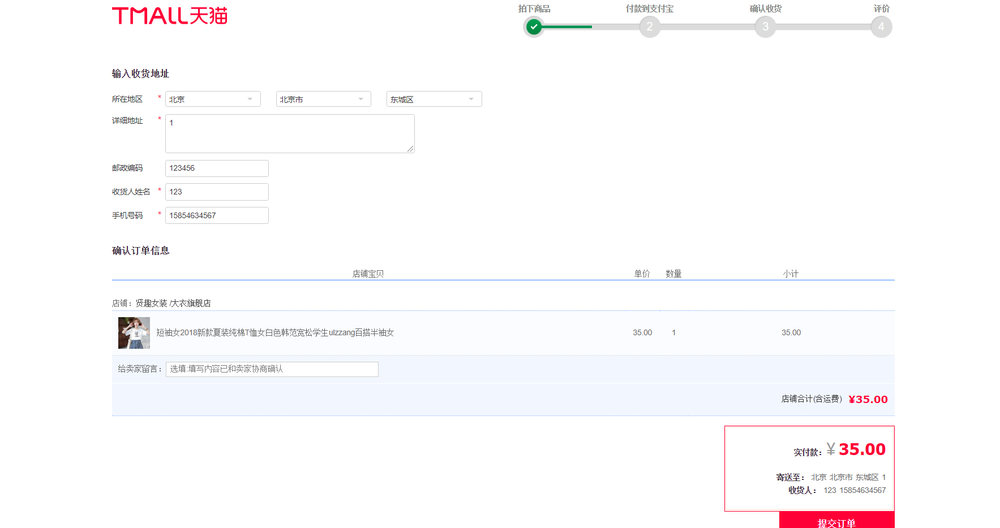
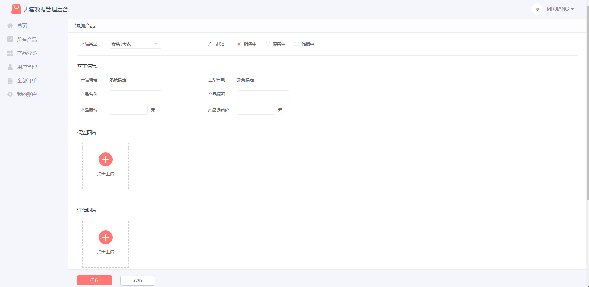
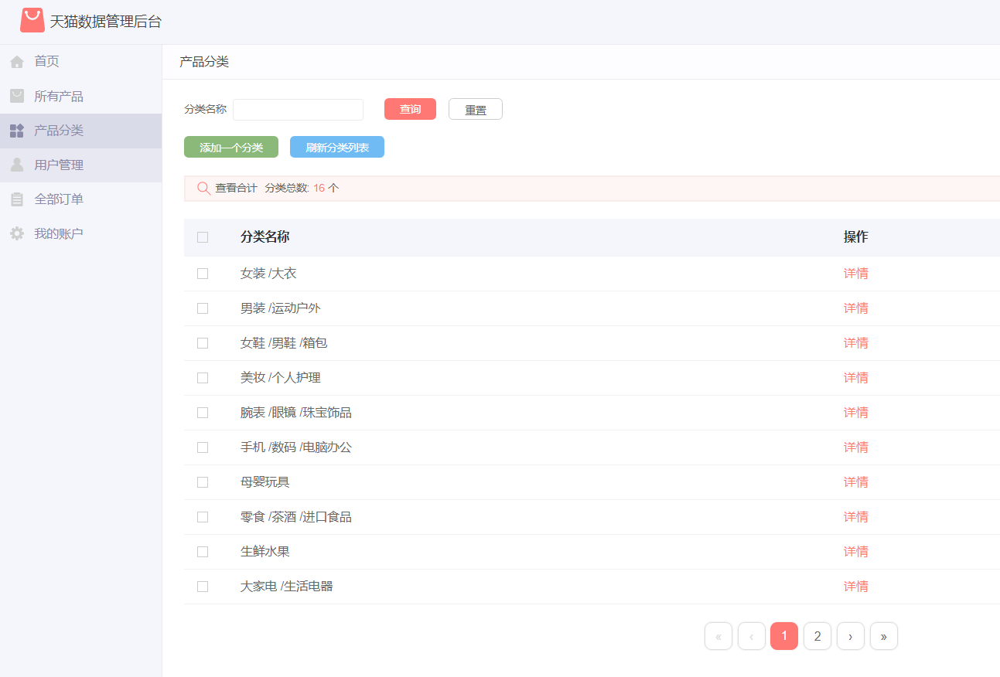
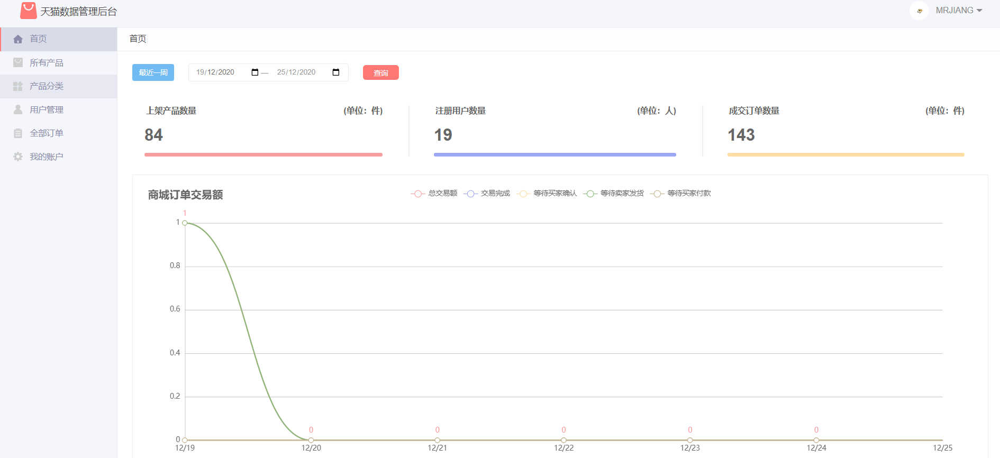

# 项目名称
# tmallShop
基于 java+SpringBoot+mybatis+mysql实现的仿天猫商城项目，SpringBooot商城项目（期末大作业，毕业设计） java商城，SpringBoot商城，jsp商城，mysql商城， java商城，servlet商城，jsp商城，mysql商城。 java，servlet商城，jsp商城，mysql商城

## 安装与下载【idea与eclipse】
## 加QQ：2108657327 发项目源代码！！ 可以帮助远程调试运行好 【源码+数据库+远程调试】

## 特性/功能

java+SpringBoot+mybatis+mysql实现的仿天猫商城项目

期末大作业，毕业设计

mvc 模式   

具体功能如下截图：
  登录，注册，购物车，商品收索，订单，支付，用户管理，商品管理，订单管理，购物车管理，分类管理等，统计曲线
  

## 用户端功能以及截图
### 1.首页

### 2.登录                

### 3.注册

### 4.分类展示

### 5.商品详情【长截图】

### 6.我的购物车

### 7.提交订单

### 9.我的订单

### 11.搜索功能
  实现

## 管理端功能以及截图

### 1.管理登录

### 2.用户管理【增，删，改，查】

### 3.商品管理【增，删，改，查】

### 4.商品添加

### 5.商品修改

### 6.商品分类管理【增，删，改，查】

### 7.订单管理

### 8.统计

## 安装与下载【idea与eclipse均可运行】
### 加QQ：2108657327 免费获取项目源代码！！！ 
